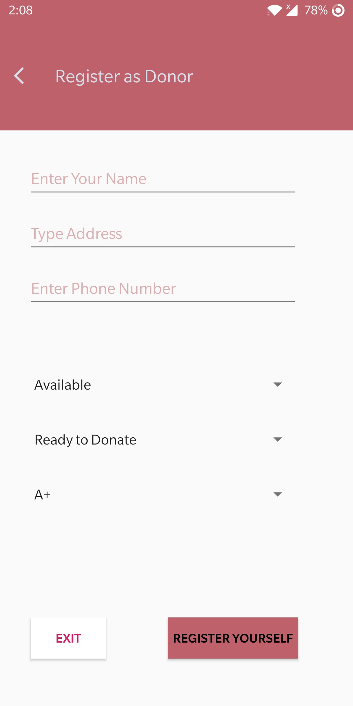
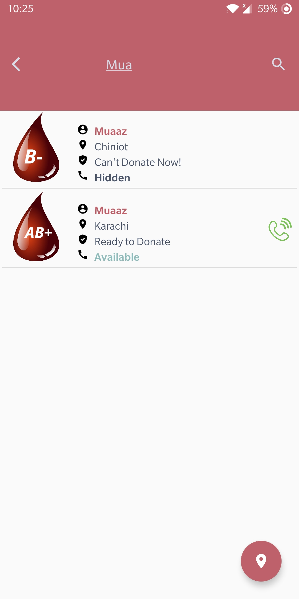
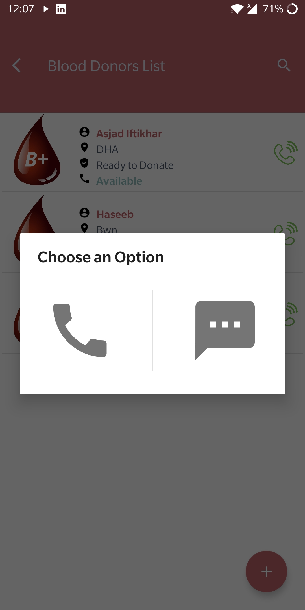

# Blood Donor App
## An Android Application to connect with blood donors.

[](https://github.com/AsjadIftikhar/PandaCompiler.git)

Blood Donor is a Java-Android/Firebase based mobile application to connect with Blood donors near you!
It is created in Software for Mobile Devices Course during Fall 2021 by

## Features

- View Active/Inactive Donors
- Signup as a Donor
- Call or Text a Donor
- Firebase
- 3 Tier architecture
- Sqlite
- Search User based on Name, Blood Group or Address
- RecycleView
- Responsive

## Screenshots

### Home Page


### Sign Up Page



### Search in RecycleView



### Contact



## Installation

Blood Donor App requires Android Studio to build project

Step 1.

```sh
Create Empty Android Project
```

Step 2.


```sh
Make Sure to Use SDK Tool 30.0.2

```

Step 3.

```sh
Replace the src Folder
```


Good Luck! Have a nice day.

